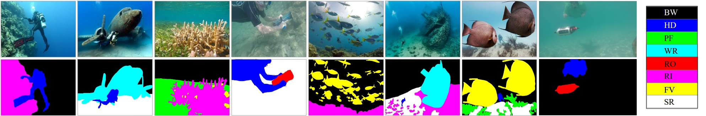
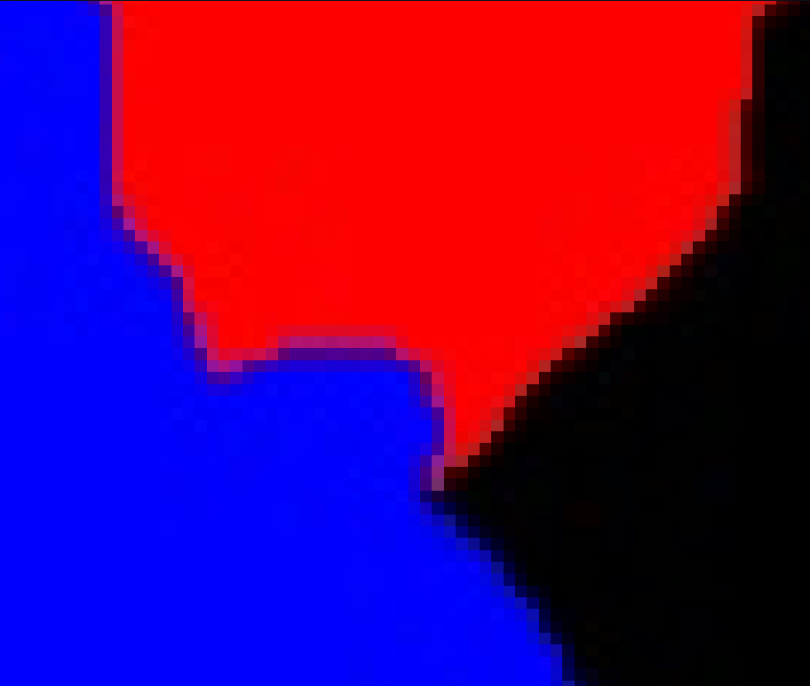
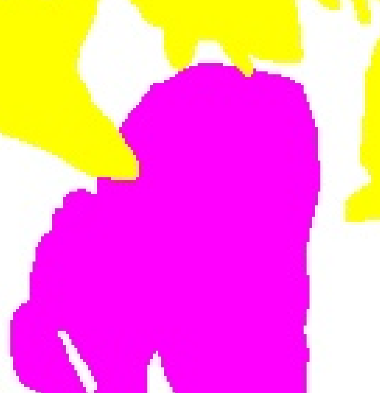
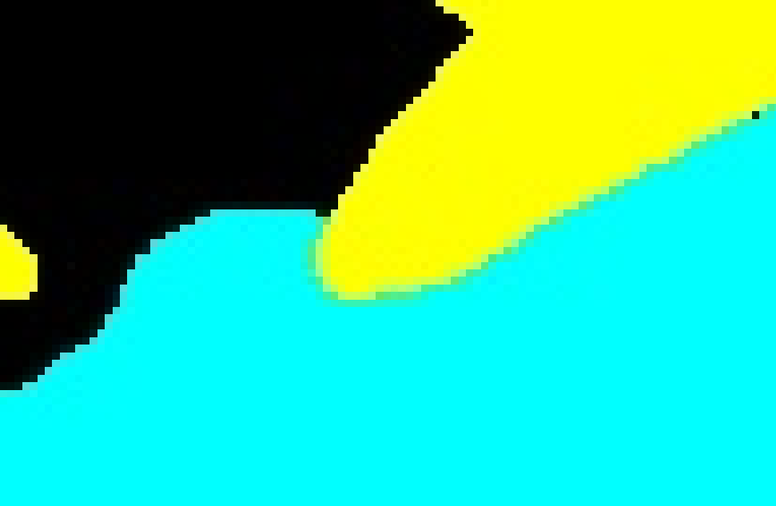
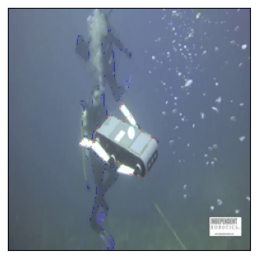
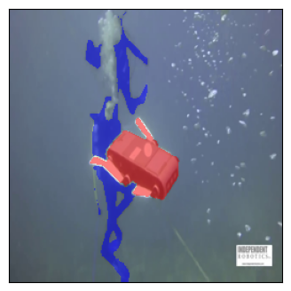

# SUIM Dataset

SUIM is a dataset proposed by [Minnesota Interactive Robotics and Vision Laboratory](https://irvlab.cs.umn.edu/resources/suim-dataset). The details about this dataset are demonstrated below:

- For semantic segmentation of natural underwater images
- 1525 annotated images for training/validation and 110 samples for testing
- Categories:
    - **BW**: Background/waterbody, 000 (black)
    - **HD**: human divers, 001 (blue)
    - **PF**: Aquatic plants and sea-grass, 010 (green)
    - **WR**: Wrecks/ruins, 011 (sky)
    - **RO**: Robots/instruments, 100 (red)
    - **RI**: Reefs/invertebrates, 101 (pink)
    - **FV**: Fish and vertebrates, 110 (yellow)
    - **SR**: Sea-floor/rocks, 111 (white)
- Samples:
    

**Thanks to this awesome dataset, we can do research on underwater image segmentation more easily!** 😊

## Why I create this repo?

However, I found there exits two problems in this dataset:

1. Some **masks** in `train_val` folder are annotated with inaccurate RGB colors, thereby causing an obstacle for extracting masks information from masks files.

    For example, magnifying these three masks files (i.e., `d_r_5_.bmp`, `f_r_1007_.bmp`, and `w_r_24_.bmp` in `train_val/masks` folder), and you can find values of colors are improper in the border between two segments and other areas. You can use **color picking tools** to check them.

    <div align="center">
      
      
      
    </div>

    <details>
      <summary>The list of masks files with improper colors:</summary>
      <p>
      
      ```
        d_r_112_.jpg d_r_112_.bmp
        d_r_135_.jpg d_r_135_.bmp
        d_r_174_.jpg d_r_174_.bmp
        d_r_179_.jpg d_r_179_.bmp
        d_r_189_.jpg d_r_189_.bmp
        d_r_20_.jpg d_r_20_.bmp
        d_r_270_.jpg d_r_270_.bmp
        d_r_273_.jpg d_r_273_.bmp
        d_r_293_.jpg d_r_293_.bmp
        d_r_301_.jpg d_r_301_.bmp
        d_r_310_.jpg d_r_310_.bmp
        d_r_333_.jpg d_r_333_.bmp
        d_r_470_.jpg d_r_470_.bmp
        d_r_473_.jpg d_r_473_.bmp
        d_r_564_.jpg d_r_564_.bmp
        d_r_59_.jpg d_r_59_.bmp
        d_r_5_.jpg d_r_5_.bmp
        d_r_633_.jpg d_r_633_.bmp
        d_r_65_.jpg d_r_65_.bmp
        d_r_741_.jpg d_r_741_.bmp
        d_r_759_.jpg d_r_759_.bmp
        f_r_1006_.jpg f_r_1006_.bmp
        f_r_1007_.jpg f_r_1007_.bmp
        f_r_1013_.jpg f_r_1013_.bmp
        f_r_1058_.jpg f_r_1058_.bmp
        f_r_1068_.jpg f_r_1068_.bmp
        f_r_1069_.jpg f_r_1069_.bmp
        f_r_1070_.jpg f_r_1070_.bmp
        f_r_1133_.jpg f_r_1133_.bmp
        f_r_1142_.jpg f_r_1142_.bmp
        f_r_1151_.jpg f_r_1151_.bmp
        f_r_1154_.jpg f_r_1154_.bmp
        f_r_1183_.jpg f_r_1183_.bmp
        f_r_1214_.jpg f_r_1214_.bmp
        f_r_1233_.jpg f_r_1233_.bmp
        f_r_1246_.jpg f_r_1246_.bmp
        f_r_1259_.jpg f_r_1259_.bmp
        f_r_1267_.jpg f_r_1267_.bmp
        f_r_1274_.jpg f_r_1274_.bmp
        f_r_1289_.jpg f_r_1289_.bmp
        f_r_1290_.jpg f_r_1290_.bmp
        f_r_1300_.jpg f_r_1300_.bmp
        f_r_1302_.jpg f_r_1302_.bmp
        f_r_1318_.jpg f_r_1318_.bmp
        f_r_1324_.jpg f_r_1324_.bmp
        f_r_1332_.jpg f_r_1332_.bmp
        f_r_1382_.jpg f_r_1382_.bmp
        f_r_1394_.jpg f_r_1394_.bmp
        f_r_1424_.jpg f_r_1424_.bmp
        f_r_1491_.jpg f_r_1491_.bmp
        f_r_1515_.jpg f_r_1515_.bmp
        f_r_1570_.jpg f_r_1570_.bmp
        f_r_1664_.jpg f_r_1664_.bmp
        f_r_1779_.jpg f_r_1779_.bmp
        f_r_1812_.jpg f_r_1812_.bmp
        f_r_1816_.jpg f_r_1816_.bmp
        f_r_1866_.jpg f_r_1866_.bmp
        f_r_1879_.jpg f_r_1879_.bmp
        f_r_401_.jpg f_r_401_.bmp
        f_r_407_.jpg f_r_407_.bmp
        f_r_43_.jpg f_r_43_.bmp
        f_r_499_.jpg f_r_499_.bmp
        f_r_500_.jpg f_r_500_.bmp
        f_r_546_.jpg f_r_546_.bmp
        f_r_647_.jpg f_r_647_.bmp
        f_r_797_.jpg f_r_797_.bmp
        f_r_829_.jpg f_r_829_.bmp
        f_r_903_.jpg f_r_903_.bmp
        f_r_907_.jpg f_r_907_.bmp
        f_r_921_.jpg f_r_921_.bmp
        f_r_934_.jpg f_r_934_.bmp
        f_r_936_.jpg f_r_936_.bmp
        f_r_940_.jpg f_r_940_.bmp
        f_r_963_.jpg f_r_963_.bmp
        f_r_968_.jpg f_r_968_.bmp
        f_r_991_.jpg f_r_991_.bmp
        w_r_136_.jpg w_r_136_.bmp
        w_r_158_.jpg w_r_158_.bmp
        w_r_198_.jpg w_r_198_.bmp
        w_r_1_.jpg w_r_1_.bmp
        w_r_24_.jpg w_r_24_.bmp
        w_r_25_.jpg w_r_25_.bmp
        w_r_27_.jpg w_r_27_.bmp
        w_r_47_.jpg w_r_47_.bmp
        w_r_7_.jpg w_r_7_.bmp
      ```
      </p>
    </details>

2. The sizes of some masks do not match those of their corresponding images.

    For example:
    ```
    f_r_1058_.jpg: (590, 375)
    f_r_1058_.bmp: (590, 430)
    ```
    <details>
      <summary>The list of masks files with improper size:</summary>
      <p>
      
      ```
        f_r_1058_.jpg f_r_1058_.bmp
        f_r_1068_.jpg f_r_1068_.bmp
        f_r_1069_.jpg f_r_1069_.bmp
        f_r_1070_.jpg f_r_1070_.bmp
        f_r_1133_.jpg f_r_1133_.bmp
        f_r_1142_.jpg f_r_1142_.bmp
        f_r_1151_.jpg f_r_1151_.bmp
        f_r_1154_.jpg f_r_1154_.bmp
        f_r_1214_.jpg f_r_1214_.bmp
        f_r_1233_.jpg f_r_1233_.bmp
        f_r_1259_.jpg f_r_1259_.bmp
        f_r_1289_.jpg f_r_1289_.bmp
        f_r_1290_.jpg f_r_1290_.bmp
        f_r_1302_.jpg f_r_1302_.bmp
        f_r_1318_.jpg f_r_1318_.bmp
        f_r_1394_.jpg f_r_1394_.bmp
        f_r_1424_.jpg f_r_1424_.bmp
        f_r_1491_.jpg f_r_1491_.bmp
        f_r_1515_.jpg f_r_1515_.bmp
        f_r_1570_.jpg f_r_1570_.bmp
        f_r_1779_.jpg f_r_1779_.bmp
        f_r_1812_.jpg f_r_1812_.bmp
        f_r_1816_.jpg f_r_1816_.bmp
        f_r_1866_.jpg f_r_1866_.bmp
        f_r_1879_.jpg f_r_1879_.bmp
        f_r_401_.jpg f_r_401_.bmp
        f_r_829_.jpg f_r_829_.bmp
        f_r_921_.jpg f_r_921_.bmp
        f_r_934_.jpg f_r_934_.bmp
        f_r_968_.jpg f_r_968_.bmp
        f_r_991_.jpg f_r_991_.bmp
        w_r_1_.jpg w_r_1_.bmp
        w_r_24_.jpg w_r_24_.bmp
        w_r_25_.jpg w_r_25_.bmp
        w_r_27_.jpg w_r_27_.bmp
        w_r_47_.jpg w_r_47_.bmp
        w_r_7_.jpg w_r_7_.bmp
      ```
      </p>
    </details>

You can use [this script](./check_masks.py) to check the original `train_val` set of SUIM. Please note that you should change `image_dir` and `masks_dir` to your own in this python script.

## New SUIM Dataset
Based on problems mentioned above, I **re-annotated** these images with improper masks. You can download the *new SUIM dataset* from [👉this link](https://drive.google.com/file/d/1XFCe0DPhRxjJZmOtyxTIxrN247YLlLaQ/view?usp=sharing).

## How these improper masks impact our task

To present how these improper masks impact our task, please see the instance below.

If we want to extract segments of *human divers* and *Robots/instruments* from images, we can obtain two boolean masks based on colors used to label these two classes. In SUIM, the two colors is **blue** and **red**. I write a script here:

```python
from PIL import Image
import torch
from torchvision.utils import draw_segmentation_masks
import numpy as np
import matplotlib.pyplot as plt

# the re-annotated SUIM
img_fp = '/DataA/pwz/workshop/Datasets/SUIM_fix/train_val/images/d_r_59_.jpg'
mask_fp = '/DataA/pwz/workshop/Datasets/SUIM_fix/train_val/masks/d_r_59_.bmp'

# the original SUIM
# img_fp = '/DataA/pwz/workshop/Datasets/SUIM/train_val/images/d_r_59_.jpg'
# mask_fp = '/DataA/pwz/workshop/Datasets/SUIM/train_val/masks/d_r_59_.bmp'

img_size = (256, 256)
img = Image.open(img_fp).resize(img_size)
img = np.asarray(img, dtype=np.uint8)
mask = Image.open(mask_fp).resize(img_size)
mask = np.asarray(mask, dtype=np.uint8)

mask_shape = mask.shape[0:2]
# Human Diver
hd_mask = np.stack((np.zeros(mask_shape), np.zeros(mask_shape), np.ones(mask_shape)), axis=2)
hd_mask = (hd_mask * 255).astype(np.uint8)
# Robots
ro_mask = np.stack((np.ones(mask_shape), np.zeros(mask_shape), np.zeros(mask_shape)), axis=2)
ro_mask = (ro_mask * 255).astype(np.uint8)
hd_boolean_mask = np.all(mask == hd_mask, axis=2)
ro_boolean_mask = np.all(mask == ro_mask, axis=2)
img = torch.tensor(img.transpose(2,0,1), dtype=torch.uint8)
boolean_masks = torch.tensor(np.stack((hd_boolean_mask, ro_boolean_mask), axis=0), dtype=torch.bool)
imgs_with_masks = [draw_segmentation_masks(img, boolean_masks, alpha=0.5, colors=['blue', 'red'])]
show(imgs_with_masks)
```

If you use the original SUIM dataset, you will got this result:

<div align="center">
    
</div>

If you use the new SUIM dataset, you will got this result:

<div align="center">
    
</div>

## Acknowledgements
- [SUIM dataset](https://irvlab.cs.umn.edu/resources/suim-dataset)